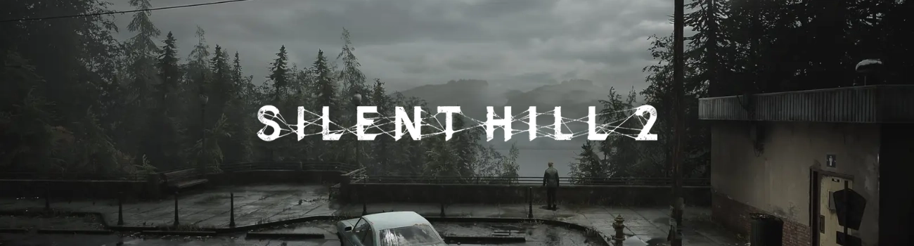

# 👋 Hi, I'm Adam

<!-- ===================== -->
<!-- WALLPAPER / BANNER -->
<!-- ===================== -->

  

---

## 🧠 About Me

I am a  3D Artist / Game Developer  specializing in game-ready models / animations / post process effects .

💡 Interests:
- Game Dev
- 3D modeling/animation and stylized enviornment
- Shaders and post process effects

🎯 Goal:
> A short, clear statement about your direction and ambitions.

---

## ⚙️ Tech Stack & Tools

### 💻 Programming Languages

### 🧰 Software & Tools

---

## 🖼️ Portfolio – Game Assets / Models

### 🎮 Modeling 

  
  
  

**Details:**
- Type: 
- Engine: 
- Tools: 
- Description: What it is and how it was used

---

### 🎮 Animations

  

I do not own the model above, the animation was for the pure entertainment purposes

   

   

**Details:**
- Type:
- Style:
- Usage:

  ### 🎮 Maps 

  
  
  
  

 

  

  
**Details:**
- Type:
- Style:
- Usage:

  ### 🎮 VFX's/Post Process 

  
  
  

**Details:**
- Type:
- Style:
- Usage:

---

## 📫 Contact

- 📧 Email: [mienkinaadam@gmail.com]
- 💼 LinkedIn: [https://www.linkedin.com/in/adam-mienkina-32b5a4375/]
- 🌐 Portfolio: [https://github.com/NorthStarBoi/Portflolio.git]

---

## 🚀 Currently Working On

- Project - Jawia - 
