# 👋 Hi, I'm Adam

<!-- ===================== -->
<!-- WALLPAPER / BANNER -->
<!-- ===================== -->

  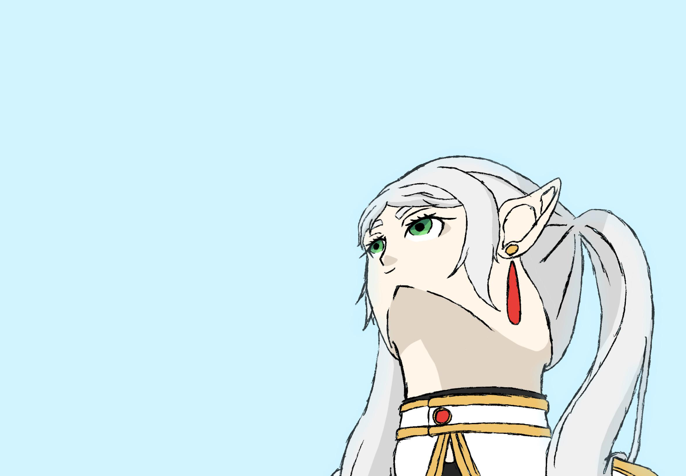

---

## 🧠 About Me

I am a  3D Artist / Game Developer  specializing in game-ready models / animations / post process effects.

💡 Interests:
- Game Dev
- 3D modeling/animation and stylized enviornment
- Shaders and post process effects
- Material workflow alongside UV placement

🎯 Goal:
> I want to make the best impression of my work I created over the span of studying at Unviersity of Silesia.

---

## ⚙️ Tech Stack & Tools

### 💻 Programming Languages

### 🧰 Software & Tools

---

## 🖼️ Portfolio – Game Assets / Models

### 🎮 Characters

  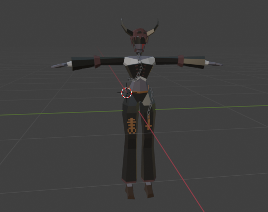
  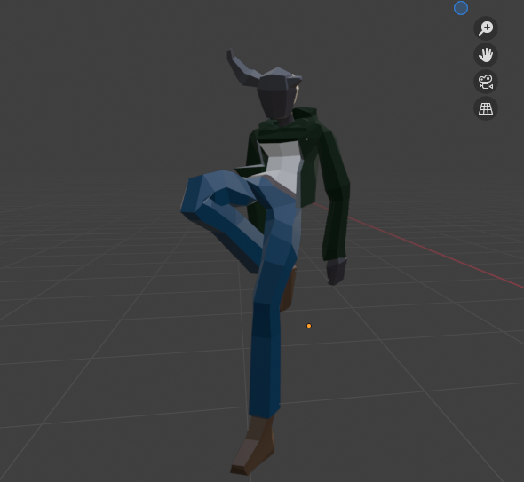
  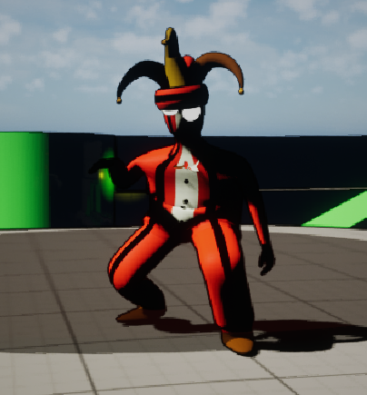

**Details:**
- Type: FBX
- Engine: Unreal Engine
- Tools: Blender / Photoshop
- Description: Two first models belong to my PSX stylized game(Withered Rose) and the third (Clown) was made for the game jam project
- P.S. there are few more characters models in the repository mentioned at the end of the read.md file

---

### 🎮 Animations

  
  
  I do not own the model above, the animation was for the pure entertainment purposes

   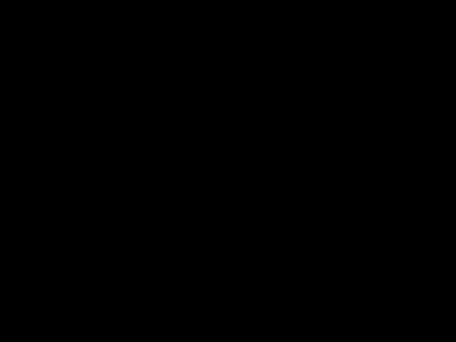

   

**Details:**
- Type: FBX
- Engine: Unreal Engine
- Tools: Blender 
- Description: Golem and chest are original models designed by me and animated aswell.
- P.S. there are few more characters animated in the repository mentioned at the end of the read.md file

---

  ### 🎮 Maps 

  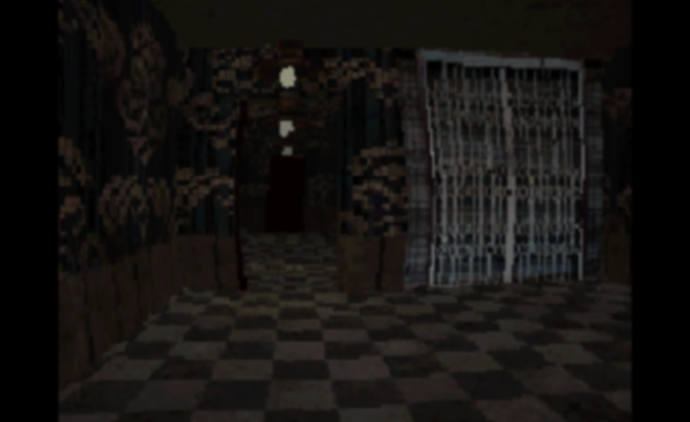
  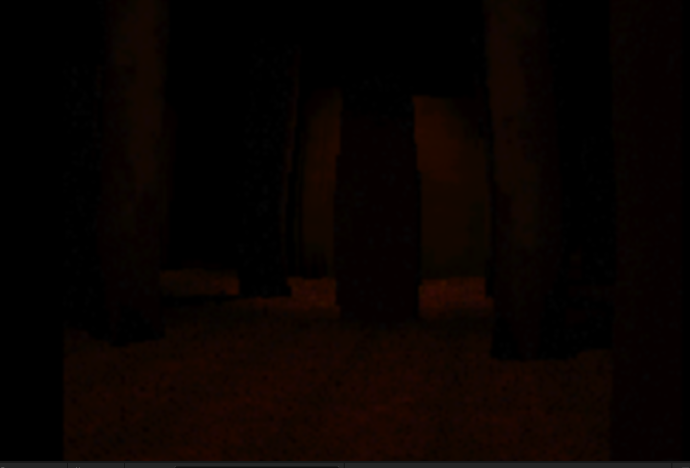
  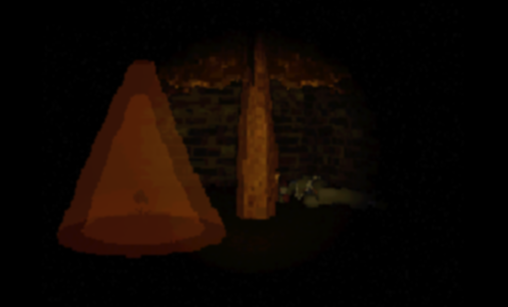
  

 

  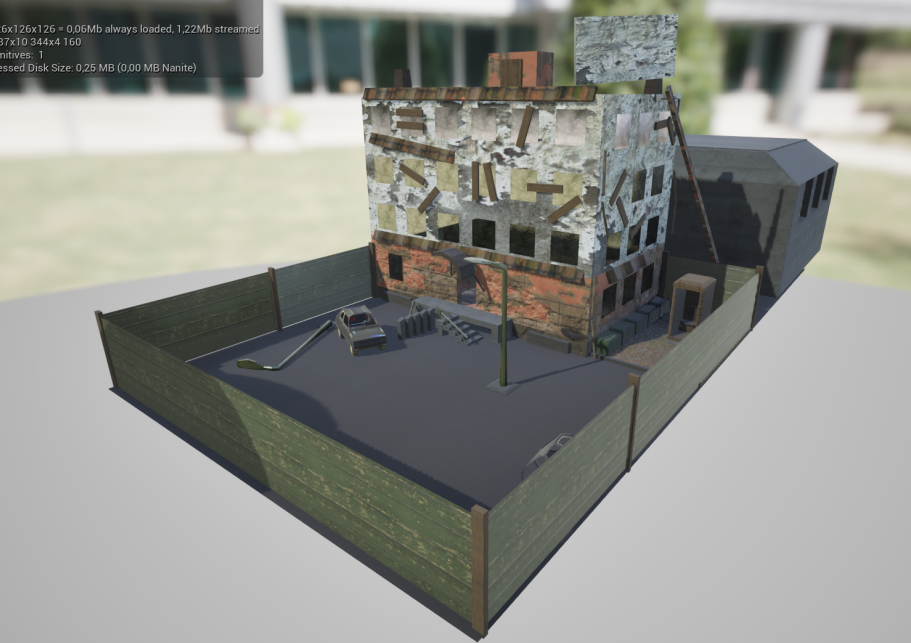

  

  

  

  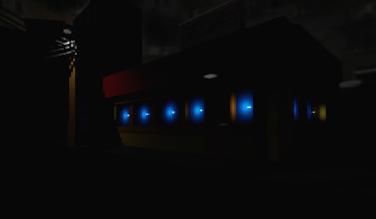

  
**Details:**
- Type: FBX
- Engine: Unreal Engine
- Tools: Blender / Photoshop
- Description: Few pixalted maps are procedurally generated places so those are only few instances of the whole level layouts in the "Withered Rose". Rest of those places were created in the heat of finishing game jam projects or study subjects at University. 

---

  ### 🎮 VFX's/Post Process 

  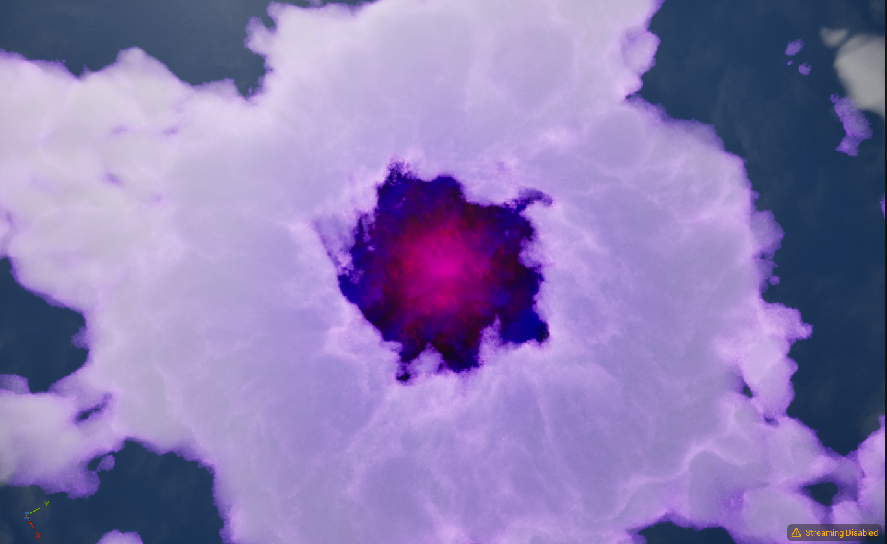
  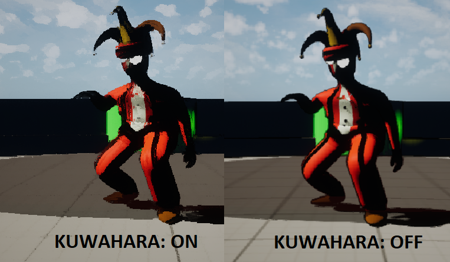

**Details:**
- Type: BP/C++ Custom nodes
- Usage: Enviornment, graphic pipline output
- Description: VFX's and effects here are used in the future upcoming project called "Jawia".
- P.S. there are few more Post process / enviornment effects recorded in the repository mentioned at the end of the read.md file

---

## 📫 Contact

- 📧 Email: [mienkinaadam@gmail.com]
- 💼 LinkedIn: [https://www.linkedin.com/in/adam-mienkina-32b5a4375/]
- 🌐 Portfolio: [https://github.com/NorthStarBoi/Portflolio.git]

---

## 🚀 Currently Working On

- Project - Jawia - Open World game inspiried by RPG maker title called Fear and Hunger, side job to polish my skills in game dev industry.
